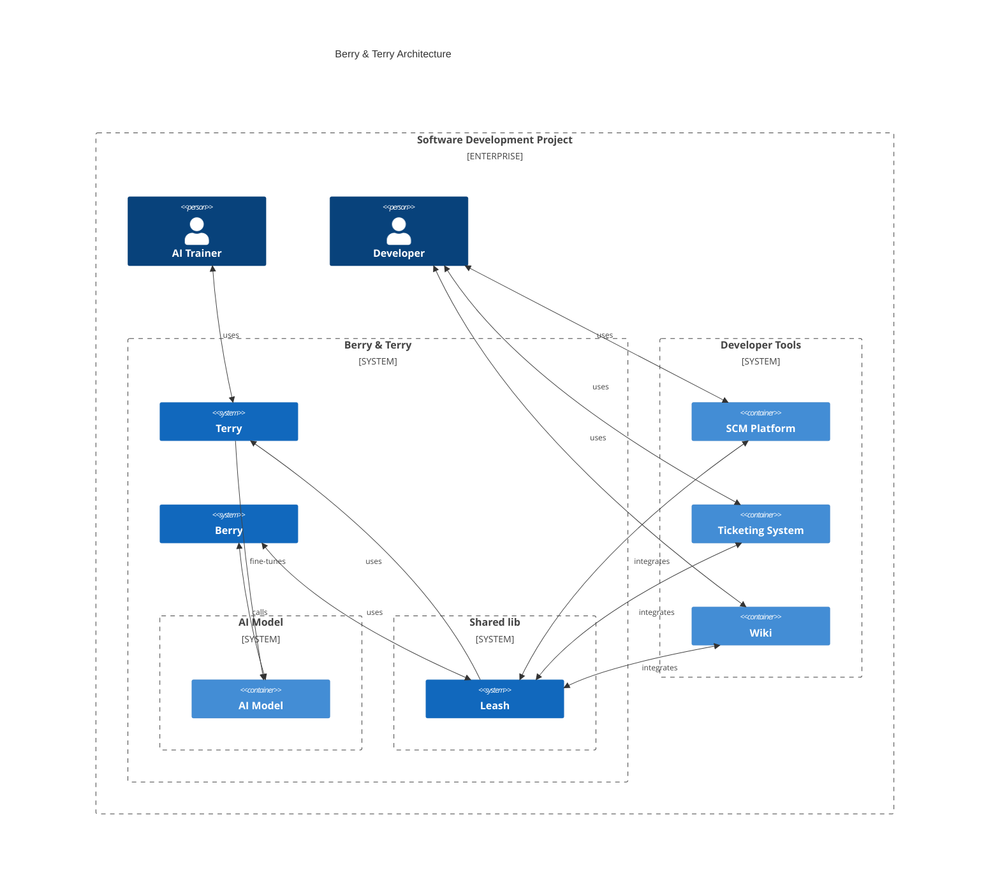

# Berry & Terry

Say hello to **Berry** & **Terry**

**B**ot - _integrates your whole heterogenous development toolchain with ai, not just one commercial ecosystem_

**T**raining - _extract and transform project data to training data._

**Berry** & **Terry** is not just AI model & service like chatGPT. 
It's a e2e development AI integration & data extraction solution, that connects to various development tools.

## Introduction

### Decoupling AI Models, AI Integration and AI Fine-tuning

**Berry** decouples the AI model from AI integration into your development toolchain. 
**Terry** decouples the AI model from AI training data extraction of your development toolchain. 

Berry & Terry facilitates an adaptive setup where the AI component can be seamlessly replaced or updated. 
This ensures your development workflows always benefit from the latest advancements in AI, 
without the need for extensive reintegration efforts.

It also allows for more sophisticated integration into heterogenous development workflows, 
as these are likely spread across multiple tools, from multiple vendors. 
In contrast commercial AI solutions (like github copilot) integrate just to vendor specific ecosystems, 
therefore not providing the same level of integration and possible data extraction for fine tuning.

### Why Berry **&** Terry, not just Berry **or** Terry?

It might make sense to see Berry & Terry as separate projects, 
as they could be developed and maintained by different teams, 
since the AI module itself is the only interface that Berry need's to communicate with. 

On the other hand, both projects need to implement clients to interact with SCM platform's and development specific services, 
like ticketing systems, wikis, etc. that are specific to conversational AI. 

Putting Berry & Terry into one project allows to test the solution e2e by itself through [Dogfooding](https://en.wikipedia.org/wiki/Eating_your_own_dog_food), 
which is also perfect for Berry & Terry as robodogo's, since they love dogfood 😊. 

## Architecture

This section describes the project architecture.
The project is split into 3 main components:

### Leash

Leash is the shared library for Berry & Terry.
It Implements the integration to various development tools.
It provides a common interface's for the types of development tools.
e.g. it abstract all SCM platform with a standard interface for multiple solutions like Github, Gitlab & Azure Devops.

### Berry

Berry is the AI integration component.
It hooks into Leash to get the data from the development tools.
It pipes the data into the AI model and returns the result back to the user through Leash.

### Terry

Terry is the AI training data extraction component.
It uses leash to extract the data from the development tools.
It transforms the data into training data for the AI model.
It helps to fine tune the AI model with project specific data.
